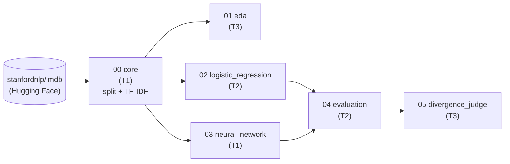

# Everyone's a Critic — Movie-Review Sentiment Classification

Classifying the sentiment of free-text movie reviews (positive / negative) and comparing two algorithm families, framed as a feature-generation component for a film recommender system.

This project is part of the **AAI-501: Introduction to Artificial Intelligence and Machine Learning** course in the Applied Artificial Intelligence program at the **University of San Diego (USD)**.

**Project status:** Active (Summer 2026; final deliverable due Aug 10, 2026)

---

## Objective

Recommender systems lean on structured signals about how audiences react to a title, yet the richest evidence — the written review — is unstructured and unusable in raw form. This project converts review text automatically into a categorical sentiment label suitable as an input feature for downstream recommendation.

We build and **empirically compare two supervised classifiers** from distinct algorithm families on identical splits, seeds, and features:

1. **Logistic regression** on TF-IDF features — a linear, interpretable baseline.
2. **A feed-forward neural network** (deep learning) over the same feature space — modeling non-linear structure.

Beyond raw accuracy, we examine *what the models learned*: the most influential TF-IDF features, whether a model trained on only the top-k features rivals the full model, and where the two approaches diverge on hard cases (negation, sarcasm, mixed reviews). An **LLM-as-judge** adjudicates the disagreement set as a generative-AI extension.

## Contributors

- **Keana Gindlesperger** (T1) — foundation + neural network
- **Yesid Cardenas Marin** (T2) — logistic regression + evaluation
- **Ian Schmitt** (T3) — EDA + divergence/LLM judge

Lane detail is recorded in [`docs/contributions.md`](docs/contributions.md); the full workload plan and calendar is [`docs/workload-plan.md`](docs/workload-plan.md).

## Methods Used

- Natural Language Processing (text preprocessing, TF-IDF vectorization)
- Machine Learning (supervised classification, logistic regression)
- Deep Learning (feed-forward neural network)
- Model evaluation & experimental comparison (precision, recall, F1, ROC-AUC, cross-validation)
- Feature importance / interpretability (top coefficients, top-k retraining)
- Generative AI (LLM-as-judge adjudication)
- Data visualization

## Technologies

- **Python 3.12**, managed with **[uv](https://docs.astral.sh/uv/)** (reproducible env + committed lockfile)
- **scikit-learn** — TF-IDF, logistic regression, metrics
- **TensorFlow / Keras** — feed-forward neural network *(added when notebook 03 is built)*
- **NumPy / pandas / SciPy** — data handling, sparse matrices
- **Hugging Face `datasets`** — dataset loading
- **matplotlib** — figures
- **An OpenAI-compatible LLM client** — the judge, local or cloud *(added when notebook 05 is built)*
- **Jupyter** notebooks; **ruff** for PEP 8

## Project Description

### Dataset

**Stanford Large Movie Review Dataset (IMDB)**, distributed via Hugging Face as [`stanfordnlp/imdb`](https://huggingface.co/datasets/stanfordnlp/imdb).

| Property | Value |
|---|---|
| Size | 50,000 labeled reviews (25,000 train / 25,000 test) |
| Classes | Binary, balanced 50/50 (positive / negative) |
| Source | Maas et al. (2011), ACL; public benchmark |
| License | See the dataset card (record it in `data/README.md`) |
| Fit for course rules | Public; ≥ 1,000 examples; not used in course assignments; modest preprocessing |

**Data budget.** Per the workload plan, model fitting uses a stratified, seeded subsample: **10,000 reviews to fit + 5,000 to validate**, carved from the 25,000-review training pool. The **full 25,000-review test set** is held out and touched exactly once, on the single final run. EDA may describe the full corpus.

### Questions we are exploring

- Does a non-linear neural network beat a linear logistic-regression baseline on the same TF-IDF features, and by how much?
- How much of the model's performance comes from a small number of features? Does a top-k model rival the full model?
- Where do the two models disagree, and are those the expected hard cases (negation, sarcasm, mixed sentiment)?
- Can an LLM adjudicate the disagreement set more reliably than either model alone?

### How the work is organized

The build is a **linear pipeline of notebooks that hand off artifacts on disk.** Each notebook reads the previous step's saved outputs and writes the next step's inputs. Nothing is passed in memory between people; the files on disk *are* the contract. This is what lets three people work in parallel — a downstream lane loads saved artifacts instead of rerunning an upstream lane's expensive steps — and it enforces the fairness rules structurally: TF-IDF is fit once and saved (no leakage), the model notebooks never load the test split, and all test-set scoring happens exactly once, in the evaluation notebook.



**Handoff contract** (full table in [`notebooks/README.md`](notebooks/README.md)):

| # | Notebook | Owner | Reads | Writes |
|---|---|---|---|---|
| 00 | `core` | T1 | `stanfordnlp/imdb` | splits table + fitted TF-IDF vectorizer |
| 01 | `eda` | T3 | splits | EDA figures + tables |
| 02 | `logistic_regression` | T2 | fit + val features | LR model, val predictions, coefficients, top-k results |
| 03 | `neural_network` | T1 | fit + val features | NN model, val predictions, training history |
| 04 | `evaluation` | T2 | val predictions + saved models; test features on the final run only | test predictions (both models, one file), metrics table, comparison figures |
| 05 | `divergence_judge` | T3 | predictions + splits (derives the disagreement set) | hard-case taxonomy, LLM adjudication table |

Ownership is a 2/2/2 split: every member has one early-phase notebook (00/01/02) and one late-phase notebook (03/04/05), so contribution runs through the whole build. Lanes, calendar, and the report/presentation split live in [`docs/workload-plan.md`](docs/workload-plan.md).

All prediction files share one schema — `id, y_true, y_pred, y_proba_pos` — and join back to review text on `id`, so evaluation is model-agnostic and any notebook can rehydrate text from the splits. Feature matrices are derived on the fly from the splits + vectorizer (via `shared.load_features`), never stored, so they can't go stale.

### Repository structure

```
movie-review-sentiment/
├── notebooks/     # the 6-step pipeline (00 core → 05 judge); see notebooks/README.md
├── src/           # shared.py — seed, paths, preprocessing params, metrics + plot helpers
├── data/          # raw + processed datasets (gitignored); provenance in data/README.md
├── artifacts/     # fitted vectorizer + trained model weights (gitignored, regenerable)
├── outputs/       # figures, tables, predictions — committed (paper deliverables + handoff)
├── report/        # final APA 7 paper artifacts; drafting happens in Google Docs
├── docs/          # contribution log, AI-use disclosure, shared-foundation decisions
├── setup.md       # environment + run instructions
├── pyproject.toml # uv-managed dependencies
└── README.md      # this file
```

Every folder carries its own README describing its expected contents.

### Roadblocks / challenges

Preprocessing choices (tokenization, stop words, n-gram range, vocabulary size) and their effect on each model; fair comparison under identical splits and comparable tuning budgets; controlling the network's capacity against a strong linear baseline; extracting interpretable features; and generalization beyond the movie-review domain (addressed as a stated limitation, not an extra experiment).

## Installation & reproducibility

Full instructions in [`setup.md`](setup.md). The short version:

```bash
git clone <repo-url>
cd movie-review-sentiment
uv sync                 # creates .venv and installs pinned dependencies
```

Then run the notebooks **in order, 00 → 05**. From a clean clone, the pipeline regenerates every figure and number in the paper. The test set is touched exactly once, on the final run.

## Scope fence (explicitly not doing)

No recommender system and no per-title aggregation (the corpus has no title IDs — the framing stays "a feature-generation component for a recommender"). The LLM judge is an adjudicator on the disagreement set only: no explanation pipeline, no third headline model. Tuning is capped at comparable, documented budgets, not exhaustive search. Generalization beyond movie reviews is one limitations paragraph.

## Integrity & AI-use disclosure

APA 7 throughout; no fabricated source, figure, or result. This course permits AI use **with disclosure** — the running log in [`docs/ai-use-log.md`](docs/ai-use-log.md) records what tools did what, so the paper's disclosure and APA citation are accurate. The whole team must understand and be able to defend every result (Turnitin and the required contribution appendix make that individually accountable).

## License

Released under the [MIT License](LICENSE).

## Acknowledgments

Prof. Andrew Van Benschoten, Ph.D. (AAI-501 instructor), and the maintainers of the IMDB dataset (Maas et al., 2011) and the open-source Python ML ecosystem.
